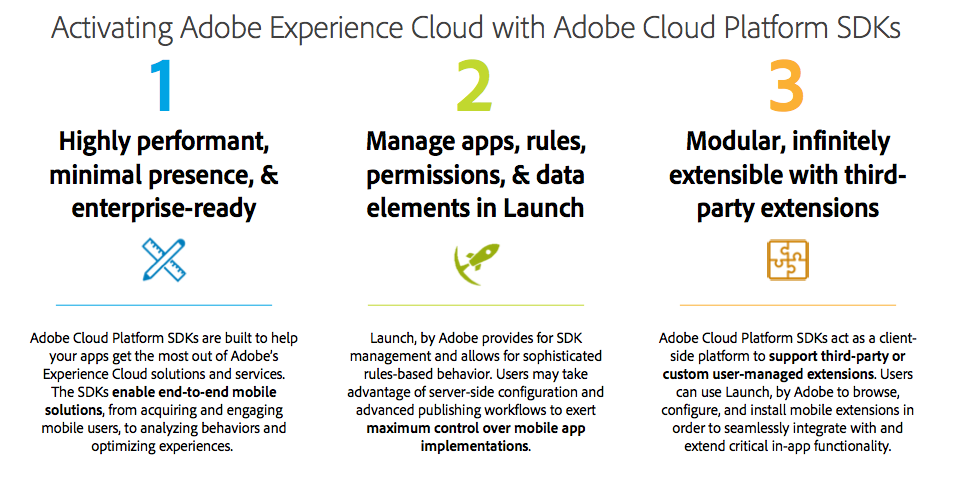

# Adobe Experience Platform SDKs
Home of the official Adobe Experience Platform (AEP) SDKs for mobile apps.

[Adobe Launch](https://launch.adobe.com/) and Adobe Experience Platform SDKs are coming together to help you take advantage of [Adobe's Experience Cloud](https://www.adobe.com/experience-cloud.html) in your mobile app.

</img>

To learn more about your topic of interest, click the following links:

- [Adobe Experience Platform SDK documentation](https://developer.adobe.com/client-sdks/documentation/)
- [Launch documentation](https://docs.adobelaunch.com/)
- [Mobile on Launch forums](https://forums.adobe.com/community/experience-cloud/platform/launch/sdk)

# Release Notes
- [Adobe Experience Platform Mobile SDK Release Notes](https://developer.adobe.com/client-sdks/documentation/release-notes)

# Latest Versions

| Extension | Cocopods | Maven | Github |
| :--- | :--- | :--- | :--- |
| [Mobile Core](https://developer.adobe.com/client-sdks/documentation/mobile-core) |  |  | [Android](https://github.com/Adobe-Marketing-Cloud/acp-sdks/tree/master/android) \| [iOS](https://github.com/Adobe-Marketing-Cloud/acp-sdks/tree/master/iOS/ACPCore) |
| [Adobe Analytics](https://developer.adobe.com/client-sdks/documentation/adobe-analytics) |  |  | [Android](https://github.com/Adobe-Marketing-Cloud/acp-sdks/tree/master/android) \| [iOS](https://github.com/Adobe-Marketing-Cloud/acp-sdks/tree/master/iOS/ACPAnalytics) |
| [Adobe Analytics - Mobile Services](https://developer.adobe.com/client-sdks/documentation/adobe-analytics-mobile-services) |  |  | [Android](https://github.com/Adobe-Marketing-Cloud/acp-sdks/tree/master/android) \| [iOS](https://github.com/Adobe-Marketing-Cloud/acp-sdks/tree/master/iOS/ACPMobileServices) |
| [Adobe Media Analytics for Audio & Video](https://developer.adobe.com/client-sdks/documentation/adobe-media-analytics) |  |  | [Android](https://github.com/Adobe-Marketing-Cloud/acp-sdks/tree/master/android) \| [iOS](https://github.com/Adobe-Marketing-Cloud/acp-sdks/tree/master/iOS/ACPMedia) |
| [Adobe Audience Manager](https://developer.adobe.com/client-sdks/documentation/adobe-audience-manager) |  |  | [Android](https://github.com/Adobe-Marketing-Cloud/acp-sdks/tree/master/android) \| [iOS](https://github.com/Adobe-Marketing-Cloud/acp-sdks/tree/master/iOS/ACPAudience) |
| [Adobe Campaign Classic](https://developer.adobe.com/client-sdks/documentation/adobe-campaignclassic) |  |  | [Android](https://github.com/Adobe-Marketing-Cloud/acp-sdks/tree/master/android) \| [iOS](https://github.com/Adobe-Marketing-Cloud/acp-sdks/tree/master/iOS/ACPCampaignClassic) |
| [Adobe Campaign Standard](https://developer.adobe.com/client-sdks/documentation/adobe-campaign-standard) |  |  | [Android](https://github.com/Adobe-Marketing-Cloud/acp-sdks/tree/master/android) \| [iOS](https://github.com/Adobe-Marketing-Cloud/acp-sdks/tree/master/iOS/ACPCampaign) |
| [Adobe Target](https://developer.adobe.com/client-sdks/documentation/adobe-target) |  |  | [Android](https://github.com/Adobe-Marketing-Cloud/acp-sdks/tree/master/android) \| [iOS](https://github.com/Adobe-Marketing-Cloud/acp-sdks/tree/master/iOS/ACPTarget) |
| [Places](https://developer.adobe.com/client-sdks/documentation/places-extension-1) |  |  | [Android](https://github.com/Adobe-Marketing-Cloud/acp-sdks/blob/master/android/places-1.0.0.aar) \| [iOS](https://github.com/Adobe-Marketing-Cloud/acp-sdks/tree/master/iOS/ACPPlaces) |
| [Places Monitor](https://developer.adobe.com/client-sdks/documentation/places-extension-1/places-monitoring-extension) |  |  | [Android](https://github.com/adobe/places-monitor-android) \| [iOS](https://github.com/adobe/places-monitor-ios) |
| [AEPAssurance](https://developer.adobe.com/client-sdks/documentation/adobe-experience-platform-assurance) |  |  | [Android](https://github.com/Adobe-Marketing-Cloud/acp-sdks/tree/master/android) \| [iOS](https://github.com/Adobe-Marketing-Cloud/acp-sdks/tree/master/iOS/AEPAssurance) |
| [Profile](https://developer.adobe.com/client-sdks/documentation/profile) |  |  | [Android](https://github.com/Adobe-Marketing-Cloud/acp-sdks/tree/master/android) \| [iOS](https://github.com/Adobe-Marketing-Cloud/acp-sdks/tree/master/iOS/ACPUserProfile) |

## Installing the AEP SDK for Android

The AEP SDK supports Android API 14 (Ice Cream Sandwich) and newer.

#### Installation using Maven/Gradle << Preferred >>
Installation via [Maven](https://maven.apache.org/) & [Gradle](https://gradle.org/) is the easiest and recommended way to get the AEP SDK into your Android app.  In your `build.gradle` file, include the following dependencies:

    implementation 'com.adobe.marketing.mobile:sdk-core:1.+'
    implementation 'com.adobe.marketing.mobile:analytics:1.+'
    implementation 'com.adobe.marketing.mobile:audience:1.+'
    implementation 'com.adobe.marketing.mobile:campaign:1.+'
    implementation 'com.adobe.marketing.mobile:campaignclassic:1.+'
    implementation 'com.adobe.marketing.mobile:target:1.+'
    implementation 'com.adobe.marketing.mobile:assurance:1.+'
    implementation 'com.adobe.marketing.mobile:userprofile:1.+'

#### Manual installation
In order to do a manual installation of the AEP SDK `.aar` binaries, complete the following steps for each `.aar` you need:
- Download the `.aar` file from the `Android/` directory on the `master` branch.
- Go to "File > New > New Module" in the menu.
- Select the "Import .JAR/.AAR Package" from the New Module window.
- In the "Import Module from Library" dialog, enter the path to the `.aar` you are installing.
   - Enter a Subproject Name of your choice.
- Click "Finish".
- Once Gradle sync is complete and you see the library as a module in the Android project view, add the new library module as a dependency to your app.
   - Right-click on your app module, and select "Open Module Settings".
   - In the next dialog, select your app and click on the "Dependencies" tab.
   - Click on the "+" button on the bottom, and select module dependency.
   - In the next dialog, select the library module as your dependency.

__Important__ - _all_ AEP SDK Android binaries depend on `core-1.x.x.aar`.

## Installing the AEP SDK (2.x) for iOS

> ⚠️ __Important__ 
> 
> A newer version of the [AEP Mobile SDKs (3.x)](https://developer.adobe.com/client-sdks/documentation/resources/upgrading-to-aep/current-sdk-versions#ios-swift) is now available! These SDKs are open source, bring many exciting new features and include support for Swift Package Manager (SPM), CocoaPods and XCFrameworks.
> If you are currently using our Objective-C (ACP-prefix 2.x) libraries, please see the [Migrating to Swift](https://developer.adobe.com/client-sdks/documentation/resources/migrate-to-swift) guide for next steps.

__Important__ - The latest versions of the AEP SDK for iOS are distributed using XCFrameworks. If using the XCFramework distribution, Xcode 12 or newer is required and Cocoapods 1.10.0 or newer is required (where applicable).
The AEP SDK supports iOS 10 and newer.

#### Installation using Cocoapods << Preferred >>
Installation via [Cocoapods](https://cocoapods.org/) is the easiest and recommended way to get the AEP SDK into your iOS app.  In your `Podfile`, simply add the following changes as needed:

    # minimum supported version of iOS is 10.0
    platform :ios, '10.0'    

    # Uncomment the next line if you're using Swift or would like to use dynamic frameworks
    # use_frameworks!
    
    # Adobe ACP Pods
    pod 'ACPCore', '~> 2.0'
    pod 'ACPAnalytics', '~> 2.0'
    pod 'ACPAudience', '~> 2.0'
    pod 'ACPCampaign', '~> 1.0'
    pod 'ACPCampaignClassic', '~> 2.0'
    pod 'ACPTarget', '~> 2.0'
    pod 'AEPAssurance', '~> 1.0'
    pod 'ACPUserProfile', '~> 2.0'

#### Manual installation - XCFrameworks
In order to do a manual installation of the AEP SDK XCFrameworks, complete the following steps:
- Download the extensions needed by your app from the `iOS/` directory.
- In the Xcode project create a new Group, then drag all the extensions downloaded and drop them under the group. Verify the following:
    * `The Copy Items if needed checkbox` is selected.
    * `Create groups` is selected.
    * In the `Add to targets` section, select all the targets that need AEP SDKs.
- Select your project from the `Project Navigator`, select your App from the `TARGETS` frame, then select the `General` tab at the top of the window.
- In the `Link Binary With Libraries` section, click the `+` link and add the following frameworks and libraries: `UIKit`, `SystemConfiguration`, `WebKit`, `UserNotifications`, `libsqlite3.0`, `libc++`, `libz`.
- If you have a Swift application, include a bridging header and import the AEP SDK headers available in the include folder. For more information see [Importing Objective-C into Swift](https://developer.apple.com/documentation/swift/imported_c_and_objective-c_apis/importing_objective-c_into_swift)

__Important__ - _all_ AEP SDK iOS XCFrameworks depend on `ACPCore.xcframework`.

#### Manual installation - static libraries
In order to do a manual installation of the AEP SDK libraries, complete the following steps:
- Download the extensions needed by your app from the `iOS/` directory.
- In the Xcode project create a new Group, then drag all the extensions downloaded and drop them under the group. Verify the following:
    * `The Copy Items if needed checkbox` is selected.
    * `Create groups` is selected.
    * In the `Add to targets` section, select all the targets that need AEP SDKs.
- Select your project from the `Project Navigator`, select your App from the `TARGETS` frame, then select the `General` tab at the top of the window.
- In the `Link Binary With Libraries` section, click the `+` link and add the following frameworks and libraries: `UIKit`, `SystemConfiguration`, `WebKit`, `UserNotifications`, `libsqlite3.0`, `libc++`, `libz`.
- __Important__ - If you have a Swift application, include a bridging header and import the AEP SDK headers available in the include folder. For more information see [Importing Objective-C into Swift](https://developer.apple.com/documentation/swift/imported_c_and_objective-c_apis/importing_objective-c_into_swift).

__Important__ - _all_ AEP SDK iOS libraries depend on `libACPCore.a`.
