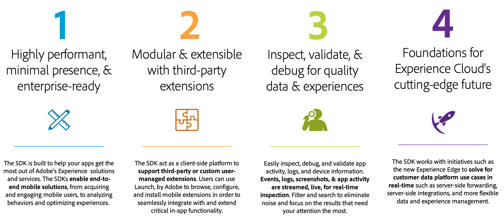

# Adobe Cloud Platform SDKs
Home of the official Adobe Cloud Platform (ACP) SDKs for mobile apps.

[Adobe Launch](https://launch.adobe.com/) and Adobe Cloud Platform SDKs are coming together to help you take advantage of [Adobe's Experience Cloud](https://www.adobe.com/experience-cloud.html) in your mobile app.

</img>

Please click a link below to learn more about your topic of interest:

- [Launch documentation](https://docs.adobelaunch.com/)
- [Mobile on Launch extension documentation](https://docs.adobelaunch.com/extension-reference/mobile/mobile)
- [ACP SDK documentation](https://docs.adobelaunch.com/)
- Installing the ACP SDK for Android
  - [Installation using Gradle << Preferred >>](#gradle)
  - [Manual installation](#manual-android)
- Installing the ACP SDK for iOS
  - [Installation using Cocoapods << Preferred >>](#cocoapods)
  - [Manual installation](#manual-ios)

## Installing the ACP SDK for Android

The ACP SDK supports Android API 14 (Ice Cream Sandwich) and newer.

#### Installation using Maven/Gradle << Preferred >>
Installation via [Maven](https://maven.apache.org/) & [Gradle](https://gradle.org/) is the easiest and recommended way to get the ACP SDK into your Android app.  In your `build.gradle` file, include the following dependencies:

    implementation 'com.adobe.marketing.mobile:sdk-core:1.+'
    implementation 'com.adobe.marketing.mobile:analytics:1.+'
    implementation 'com.adobe.marketing.mobile:audience:1.+'
    implementation 'com.adobe.marketing.mobile:target:1.+'
    implementation 'com.adobe.marketing.mobile:userprofile:1.+'

#### Manual installation
In order to do a manual installation of the ACP SDK `.aar` binaries, please complete the following steps for each `.aar` you need:
- Download the `.aar` file from the `Android/` directory on the `master` branch.
- Go to "File > New > New Module" in the menu.
- Select the "Import .JAR/.AAR Package" from the New Module window.
- In the "Import Module from Library" dialog, enter the path to the `.aar` you are installing.
   - Enter a Subproject Name of your choice.
- Click "Finish".
- Once Gradle sync is complete and you see the library as a module in the Android project view, add the new library module as a dependency to your app.
   - Right-click on your app module, and select "Open Module Settings".
   - In the next dialog, select your app and click on the "Dependencies" tab.
   - Click on the "+" button on the bottom, and select module dependency.
   - In the next dialog, select the library module as your dependency.

__Important__ - note that all ACP SDK Android binaries depend on `core-1.x.x.aar`.

## Installing the ACP SDK for iOS

The ACP SDK supports iOS 10 and newer.

#### Installation using Cocoapods << Preferred >>
Installation via [Cocoapods](https://cocoapods.org/) is the easiest and recommended way to get the ACP SDK into your iOS app.  In your `Podfile`, simply add the following changes as needed:

    # minimum supported version of iOS is 10.0
    platform :ios, '10.0'

    # ACP SDKs leverage dynamic frameworks
    use_frameworks!

    # Adobe ACP Pods
    pod 'ACPCore', '~> 1.0'
    pod 'ACPAnalytics', '~> 1.0'
    pod 'ACPAudience', '~> 1.0'
    pod 'ACPTarget', '~> 1.0'
    pod 'ACPUserProfile', '~> 1.0'

#### Manual installation
In order to do a manual installation of the ACP SDK frameworks, please complete the following steps:
- Download the frameworks needed by your app from the `iOS/` directory.
- Copy the frameworks into your Xcode app.  Do not add them to any of your App's targets.
- Select your project from the `Project Navigator`, select your App from the `TARGETS` frame, then select the `General` tab at the top of the window.
- In the `Embedded Binaries` section, click the `+` link and select all the ACP frameworks you need to add.
  - __Important__ - for a manual installation, you will need to use the universal framework to build to a simulator, but switch to using the device-only framework prior to submitting a build to Apple.  Any build submitted to Apple containing architecture slices for simulator will result in immediate rejection of your app.

__Important__ - note that all ACP SDK iOS frameworks depend on `ACPCore.framework` and `AdobeMarketingMobileCore.framework`.
